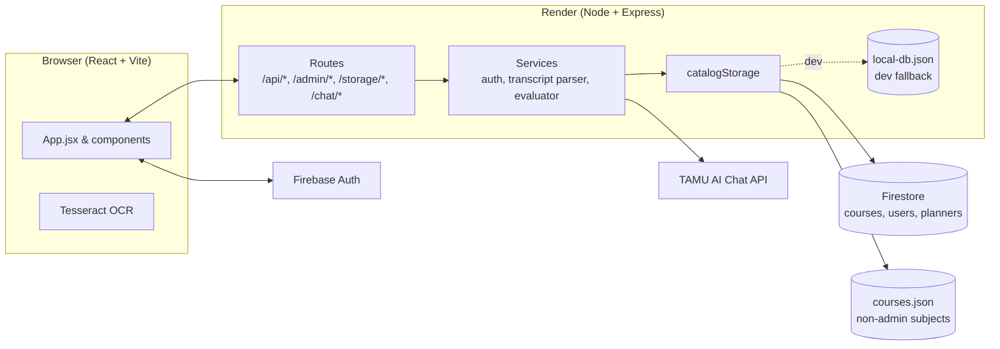

# Architecture

DegreeFlow is a classic three-tier web app with a twist: part of its
"database" (the catalog for non-admin subjects) is shipped as a static JSON
file that's loaded into memory at boot.

## Block diagram

## Data sources

1. **Firestore (`courses` collection)** — contains every course whose
   `primary_subject` is in the admin-managed set (`CSCE`, `CPEN`, `ECEN`).
   These are the courses that can be edited through the admin panel.
2. **`tamu-planner/server/data/courses.json`** — a static snapshot of every
   other TAMU course used in our evaluator (university core, supporting
   math/science, common electives, etc.). This file is read once at boot.
3. **Firestore user subtrees** — per-user academic record, saved planner,
   and login audit rows.

On startup, `catalogStorage.ensureSeeded()` merges the two sources into an
in-memory catalog index. If both Firestore and the static file contain the
same `course_id`, the Firestore version wins.

## Request flow (evaluation)

1. Browser submits `POST /api/requirements/evaluate-local` with the current
   academic record, planner, and chosen emphasis/minor.
2. The route loads the catalog index, pulls the appropriate
   requirement rule set, and calls `evaluateRequirementsLocal()`.
3. The evaluator walks the requirement tree, matching academic-record
   courses (optionally including planned courses) and returning a nested
   result object.
4. The frontend renders the result as requirement cards with completion
   bars.

## Authentication

- Frontend users authenticate through Firebase Auth (Google provider only).
- Firebase issues an ID token that the frontend attaches to backend
  requests that need auth (e.g. saving a planner).
- The backend verifies the token with the Firebase Admin SDK and derives
  user identity from it. Admin-only routes additionally check
  `ADMIN_EMAILS`.

## Dev vs. production data

In local development without Firestore credentials, the backend falls back
to a file-based store (`data/local-db.json`) for user state. The catalog
index in that case includes only the static `courses.json` — you'll get
an empty list from the Admin panel until you point at a real Firestore.
